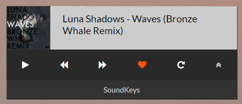

# SoundKeys

Soundkeys serves straight from Soundcloud. Benefit from the website's features and caching! 😼


The SoundCloud website wrapped in Electron with shortcuts for a native experience.


Includes a mini-player with minimal controls as well.



## Global shortcuts

| Key                            | Action            |
|:------------------------------:|:-----------------:|
| <kbd>MediaNextTrack</kbd>      | Next Track        |
| <kbd>MediaPreviousTrack</kbd>  | Previous Track    |
| <kbd>MediaPlayPause</kbd>      | Play/Pause Track  |
| <kbd>MediaStop</kbd>           | Toggle mini player|

## Notifications 

Get notified about your actions when the window is not visible. 💯  


## Install

Download from [here](https://github.com/xRealNeon/SoundKeys/releases). 💎


## Build  

Building is a piece of cake as the app uses Electron. 🍰 
1. Install [Git](https://git-scm.com/downloads) and [Node.js](https://nodejs.org/en/download/).
2. Paste this in your command line and you're done!  

```
git clone https://github.com/xRealNeon/SoundKeys.git && cd SoundKeys && npm i && npm start
```

Feel free to create an [ISSUE](https://github.com/xRealNeon/SoundKeys/issues). ✌️  
The app hasn't been tested on Linux or OSX. Please provide [feedback](https://github.com/xRealNeon/SoundKeys/issues) if you did.

## RoadMap

Check the [Projects tab](https://github.com/xRealNeon/SoundKeys/projects) for the roadmap. 😸

##### Login issues: (Only Facebook)😿

As Electron opens each window in a seperate process, login callbacks aren't triggered properly.  
If the application stalls for you, reload the page and try to login again. (Sometimes twice)  
Reload is mapped to <kbd>F5</kbd>.
